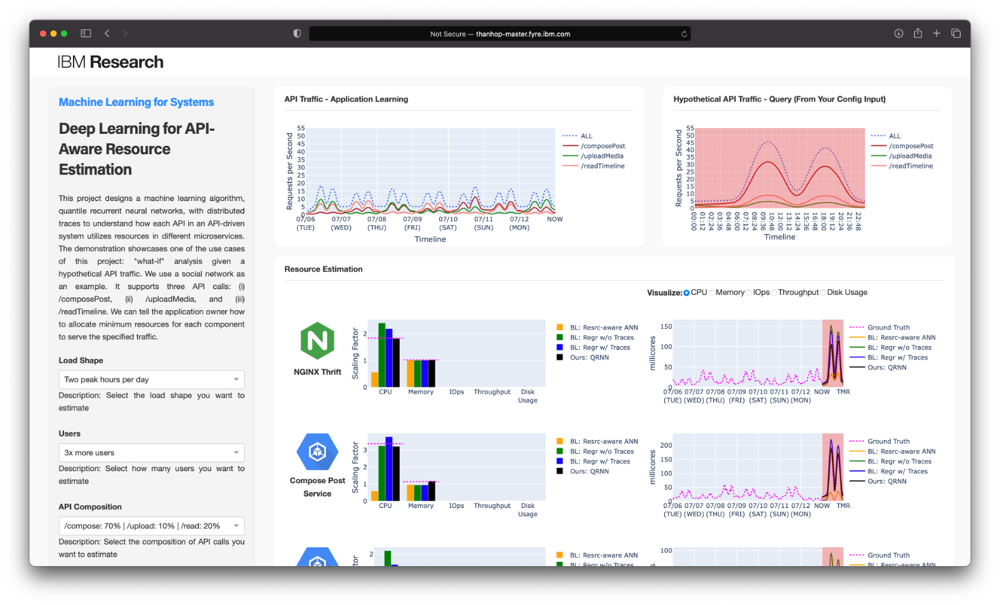

# Deep Learning for API-aware Resource Estimation

Cloud applications are increasingly shifting from monoliths to multiple fine-grained, interactive, and loosely-coupled microservices. Despite their advantages in enabling fine-grained scaling, estimating resources for each component can be challenging because an API call from an end-user can traverse along the path triggering different microservices and utilizing their resources differently based on the business logic. Distributed tracing has been gaining popularity as one of the pillars of observability. It offers end-to-end visibility from an API request perspective and provides invaluable information to learn the characteristics of each API. This project utilizes quantile recurrent neural networks in deep learning with distributed traces to automatically understand how each API utilizes resources in different microservices. We use the API-aware resource estimator to predict the scaling factor for each type of resource in each component under a hypothetical workload (e.g., 10x more users sharing photos on the social network application). The results demonstrate that our API-aware resource estimator can provide accurate and fine-grained insights on strategically reprovisioning each component.

This repository contains the source code and documentation of this project, which are organized in the following directories:
* `./social-network`: The source code of the social network application for deployment on the cloud
* `./minikube-openebs`: The source code for running OpenEBS on minikube through loop devices for experiment purposes
* `./demo`: The source code of the web UI demo
* `./exploration`: The source code of the model exploration
