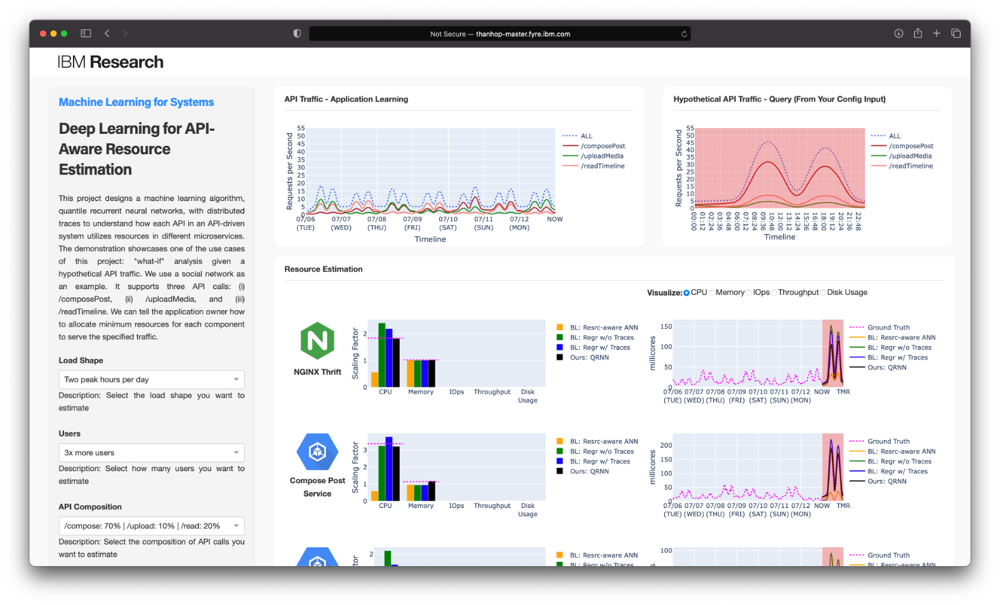

# DeepRest: Deep Resource Estimation for Interactive Microservices

Interactive microservices expose API endpoints to be invoked by users. For such applications, precisely estimating the resources required to serve specific API traffic is challenging. This is because an API request can interact with different components and consume different resources for each component. The notion of API traffic is vital to application owners since the API endpoints often reflect business logic, e.g., a customer transaction. The existing systems that simply rely on the historical resource utilization are not API-aware and thus cannot estimate the resource requirement accurately. This project develops DeepRest, a deep learning-driven resource estimation system. DeepRest formulates resource estimation as a function of API traffic and learns the causality between user interactions and resource utilization directly in a production environment. Our evaluation shows that DeepRest can estimate resource requirements with over 90% accuracy, even if the API traffic to be estimated has never been observed (e.g., 3x more users than ever or unseen traffic shape). We further apply resource estimation for application sanity checks. DeepRest identifies system anomalies by verifying whether the resource utilization is justifiable by how the application is being used. Our evaluation shows that DeepRest can successfully identify two major cybersecurity threats: ransomware and cryptojacking attacks. For more details, you can refer to our paper at EuroSys'22:
* Ka-Ho Chow, Umesh Deshpande, Sangeetha Seshadri, and Ling Liu, "DeepRest: Deep Resource Estimation for Interactive Microservices," *ACM European Conference on Computer Systems (EuroSys)*, Rennes, France, Apr. 5-8, 2022.

This repository contains the source code and documentation of this project, which are organized in the following directories. You can refer to the `README.md` file in each directory for instruction and details.
* `./web-demo`: The source code of the web UI demo
* `./minikube-openebs`: The source code for running OpenEBS on minikube through loop devices for experiment purposes
* `./social-network`: The source code of the social network application for deployment on the cloud
* `./locust`: The source code of the load generator
* `./resource-estimation`: The source code of the resource estimation
