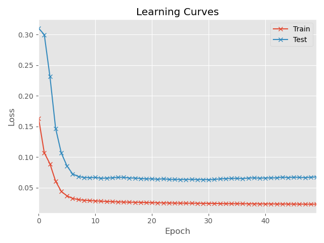

# Resource Estimation for Microservices

This directory contains the source code of resource estimation, including DeepRest and several baseline approaches. You can use the social network application and the load generator provided in this repository for experiment purposes. Alternatively, you can feed the distributed traces and the resource utilization collected in your own application by following the input format specified in the description below. For more technical details, you can refer to our paper at EuroSys'22:
* Ka-Ho Chow, Umesh Deshpande, Sangeetha Seshadri, and Ling Liu, "DeepRest: Deep Resource Estimation for Interactive Microservices," *ACM European Conference on Computer Systems (EuroSys)*, Rennes, France, Apr. 5-8, 2022.


## Installation
Follow the instruction below to create a virtual environment and install necessary Python libraries. Even though our implementation supports CPU-only environments, it is highly recommended to run on machines with GPUs as DeepRest uses deep neural networks for accurate resource estimation.

* Create and activate a virtual environment  
```bash
virtualenv venv
source venv/bin/activate
```

* Manually install the following Python libraries or run `pip install -r requirements.txt`
```bash
torch
matplotlib
seaborn
numpy
pandas
tqdm
```

## Instruction
To conduct resource estimation, you need to first conduct feature extraction using `featurize.py`, which will generate a file with a format that can be used by `estimate.py` to conduct model training and experimental comparisons. The two subsections below describe the details of each step.
### Data Preparation
While traces and resource utilization are continuously collected, we use a window size to aggregate traces and consumption within the same window such that the timeline is discretized. Such a window size can be defined as the scrape interval in the resource monitoring tool used by the application. We accept raw data with the following format:
```python
raw_data [
    ...
    {'metrics': [{'component': 'ComposePostService', 'resource': 'CPU', 'value': 5.64},
                 {'component': 'PostStorageMongoDB', 'resource': 'Write IOps', 'value': 159},
                 ...],
     'traces': [{'component': 'FrontendNGINX', 'operation': '/register', 'children': [
                     {'component': 'UserMongoDB', 'operation': '/find', 'children': []},
                     {'component': 'USerMongoDB', 'operation': '/store', 'children': []}
                 ]},
                {'component': 'FrontendNGINX', 'operation': '/compose', 'children':[...]}
    },
    ...
]
```
In particular, the raw data is an ordered list of items. Each item corresponds to the resource consumption and the distributed traces collected within the corresponding time window. As shown in the example above, it is defined as a dictionary with two entries:
* key = `metrics`: It is a list of resource consumption collected from the monitoring tool (e.g., Prometheus). For instance, the entry below means the `CPU` in `ComposePostService` has a consumption of 5.64:
```python
{'component': 'ComposePostService', 'resource': 'CPU', 'value': 5.64}
```
* key = `traces`: It is a list of traces collected by the tracing tool (e.g., Jaeger). As discussed in the paper, a trace is a collection of spans, organized as a tree structure to encode the invocation ordering. For instance, the entry below is a trace with a root span calling the operation `/register` in component `FrontendNGINX`. This operation further invokes the `/find` operation in `UserMongoDB` and the `/store` operation in `UserMongoDB`:
```python
{'component': 'FrontendNGINX', 'operation': '/register', 'children': [
     {'component': 'UserMongoDB', 'operation': '/find', 'children': []},
     {'component': 'UserMongoDB', 'operation': '/store', 'children': []}
]}
```
Note that the component names and operation names can be hashed as DeepRest does not conduct text mining to infer the meaning of the application, which can be privacy-intrusive. For example, the trace below is equivalent to the above from DeepRest's perspective:
```python
{'component': 'ae2b6c02a0ea0dbdb89c73fa522aa817', 'operation': 'd5268c3f3e0bc5a2a801c637707dc503', 'children': [
     {'component': 'f3150a81dc4dcb74bb44f6d59e537686', 'operation': 'fa82d9286fcfeba3eb4d545202fdebad', 'children': []},
     {'component': 'f3150a81dc4dcb74bb44f6d59e537686', 'operation': 'bf99285c24609b9ca74196149c26816d', 'children': []}
]}
```

Having the raw data with the above format, you can use `featurize.py` to convert it to the desired inputs for experiments. In particular, you can modify the following two variables and run `python featurize.py`:
```python
path_to_raw_data = './raw_data.pkl'  # The raw data following the format specified in the README.md
path_to_save     = './input.pkl'     # The location to save the formatted data to be used by estimate.py
```
This uses `pickle` to load the raw data from disk at `path_to_raw_data`, transforms them using DeepRest's feature engineering algorithm, and stores the feature vectors at `path_to_save`, which will be used in the next section. This script also captures necessary information for baseline approaches to operate.

### Resource Estimation Experiments
After extracting features from distributed traces, you can run `estimate.py` to conduct resource estimation experiments. Here are the main parameters you can modify:
```python
path_to_input = './input.pkl'     # The formatted data generated by featurize.py
num_epochs    = 50                # Number of training epochs
batch_size    = 32                # Batch size
learning_rate = 0.001             # Learning rate of the optimizer
split         = 0.40              # The first split*100% of the time-series will be used for application learning
step_size     = 60                # The window size for the Quantile RNN and visualization
```

The `estimate.py` cuts the input time-series into two parts according to the `split` parameter. The first part is used for model training (i.e., application learning), and the other is for testing. The recurrent architecture in DeepRest allows inference given any duration of API traffic (e.g., 10 minutes, 3 hours, 7 hours, etc.), but the training process requires a fixed duration, which is controlled by the `step_size` parameter. It is also used for visualization purposes. The scripts will run baseline estimation and DeepRest, and you can find the learning progress from the console. You can also explore `synthesize.py` to conduct experiments on trace synthesis.
```bash
...
Epoch [11/50], Train Loss: 0.028532, Test Loss: 0.067146
===== compose-post-service_cpu =====
   RESRC => Median: 10.4326 | 95-th: 103.2820 | 99-th: 136.4102 | Max: 176.4892
   COMP  => Median: 2.4985 | 95-th: 23.6328 | 99-th: 38.0245 | Max: 67.2674
   DEEPR => Median: 2.4682 | 95-th: 20.6985 | 99-th: 31.4169 | Max: 59.6848
===== nginx-thrift_cpu =====
   RESRC => Median: 7.5223 | 95-th: 61.7884 | 99-th: 87.0713 | Max: 112.5441
   COMP  => Median: 5.3128 | 95-th: 46.6526 | 99-th: 57.8389 | Max: 80.4282
   DEEPR => Median: 2.1035 | 95-th: 15.1258 | 99-th: 24.3708 | Max: 34.1505
===== media-mongodb_cpu =====
   RESRC => Median: 1.9978 | 95-th: 20.1439 | 99-th: 31.4344 | Max: 36.7979
   COMP  => Median: 3.2420 | 95-th: 25.1296 | 99-th: 31.2182 | Max: 33.9770
   DEEPR => Median: 0.9255 | 95-th: 4.5586 | 99-th: 7.3256 | Max: 9.5864
...
```
At the end of the DeepRest training, apart from visually comparing the estimation results produced by different approaches (e.g., Figure 10-11 in our paper), an optimization learning curve will be shown:




## Tested Environment
This project is tested on the following machine and environment.


This repository has been tested on the host machine with the following configuration:
* OS: Ubuntu 18.04.3 LTS
* Memory: 31.2 GiB
* Processor: Intel® Core™ i7-9700K CPU @ 3.60GHz × 8
* Graphics: GeForce RTX 2080 SUPER/PCIe/SSE2
* OS Type: 64-bit
* Disk: 2.0 TB
* VM Driver: VirtualBox
