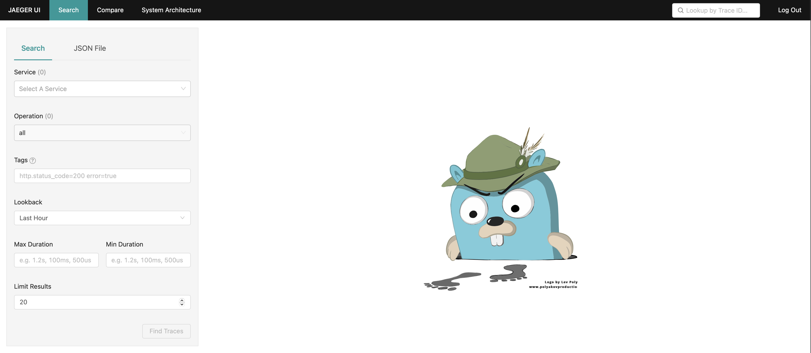
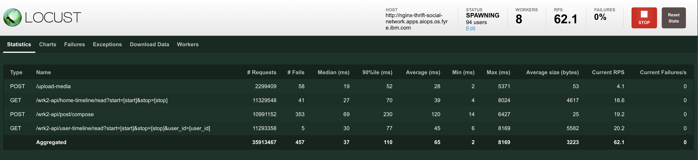

# Introduction

This repository is a social network written in a microservice architecture. It includes the following four parts:   
* `./social-network-deploy/`: the yaml files for deploying the application on the cloud
* `./social-network-source/`: the source code of the social network
* `./locust/`: the warmup script to initialize the social network with the social graph from Facebook and the client load generator sending API requests

# Deploy the Social Network
This section describes how to deploy the social network on IBM cloud.

1. Copy the `social-network-deploy` folder to the infrastructure node. You should see two folders in your current directory: (1) `assets` and (2) `k8s-yaml`.
2. Create PVCs and the initialization helper (a CentOS pod)
```bash
oc apply -f k8s-yaml/init/
```
3. Copy config files to two PVCs through the helper
```bash
oc cp assets/media-frontend/ social-network/centos:/media-config
oc cp assets/nginx-web-server/ social-network/centos:/nginx-config
oc cp assets/gen-lua/ social-network/centos:/nginx-config
```
4. Delete the helper pod
```bash
oc delete -f k8s-yaml/init/02-frontend-initializer.yaml
```
5. Start running all components of the social network
```bash
oc apply -f k8s-yaml/
```
6. Visit the OpenShift console, select `Networking` -> `Routes`, and find `social-network` in the project dropdown list
7. Click `Create Route` with the following configuration:
```
Name: nginx-thrift
Service: nginx-thrift
Target Port: 8080 -> 8080 (TCP)
```
8. Visit the nginx-thrift location shown in the `Routes` page, you should see:


9. Click `Create Route` with the following configuration:
```
Name: media-frontend
Service: media-frontend
Target Port: 8080 -> 8080 (TCP)
```
10. Visit the media-frontend location shown in the `Routes` page, you should see:


    
### Enable Jaeger for Distributed Tracing
1. Delete all running components of the social network
```bash
oc delete -f k8s-yaml/
```
2. Start an elasticsearch for trace storage and install Jaeger operator
```bash
oc apply -f k8s-yaml/tracing/init/
```
3. Start the distributed tracing with Jaeger
```bash
oc apply -f k8s-yaml/tracing/run.yaml
```
4. Start the ephemeral version of MongoDB components to trigger sidecar injection by Jaeger
```bash
oc apply -f k8s-yaml/ephemeral-mongodb/
```
5. Run all components of the social network
```bash
oc apply -f k8s-yaml/
```
6. Go to the `Routes` page in the OpenShift console again. You will see a new entry `jaeger-elasticsearch` created for you. Visit the location and you should see the following:


# Run the Load Generator on the Social Network
This section describes how to run the load generator using locust with a distributed configuration.

1. Copy the `locust` folder to the machine where you want to run the client load generator
2. Create a virtualenv with the provided `requirements.txt`. This makes sure the libraries used in this repository do not interfere with your own programming environment
```bash
python3 -m venv venv
source venv/bin/activate
pip install -r requirements
```
3. Run the warmup script to initialize the social network with a real social graph from Facebook. Replace the `XXX` below with the location the nginx-thrift obtained from the `Routes` page in Openshift Console. 
```bash
python warmup.py --addr=XXX
```
4. Edit the `locustfile.py` and replace `GLOBAL_NGINX_FRONTEND_URL` and `GLOBAL_MEDIA_FRONTEND_URL` by the URLs of nginx-thrift and media-frontend obtained from the `Routes` page in Openshift Console.

5. Run locust in a distributed setting to allow more simulated users. The example below creates one master process and eight worker processes. They can be run on the same machine, which will leverage different cores for simulating users.
```bash
locust --web-port=8090 --csv=log --csv-full-history --master
locust --web-port=8090 --csv=log --csv-full-history --worker
locust --web-port=8090 --csv=log --csv-full-history --worker
locust --web-port=8090 --csv=log --csv-full-history --worker
locust --web-port=8090 --csv=log --csv-full-history --worker
locust --web-port=8090 --csv=log --csv-full-history --worker
locust --web-port=8090 --csv=log --csv-full-history --worker
locust --web-port=8090 --csv=log --csv-full-history --worker
locust --web-port=8090 --csv=log --csv-full-history --worker
```
5. Visit the webpage with port 8090. You should see the UI similar to the following with a start button on the top right. Click it and the simulation will begin.


# Configuration and Notes
1. By default, the load generator has at most (around) 500 users. It generates periodic traffic where two peaks are simulated for each cycle. You can edit the `locustfile.py` to change the simulation configuration:
```python
GLOBAL_EXPERIMENT_DURATION = None                  # The duration of the simulation in seconds
GLOBAL_SECONDS_PER_DAY     = 3600                  # The duration of one cycle (i.e., a "day") in seconds
GLOBAL_MIN_USERS           = 100                   # Minimum number of users
GLOBAL_PEAKS               = [350, 400, 450, 500]  # Peak users to be randomly selected at the beginning of each cycle
GLOBAL_RANDOMNESS          = 0.20                  # The randomness factor in generating users
GLOBAL_WAIT_TIME           = between(1, 3)         # Each user calls an API with a random idle time between 1 and 3 seconds
GLOBAL_COMPOSITIONS        = [(20, 60, 20), ...]   # The composition of APIs per cycle => composePost:readHomeTimeline:readUserTimeline
```
2. You can specify the disk space for each pvc with the yaml files in `k8s-yaml/init/` and `k8s-yaml/tracing/init/`. The default configuration of the load generator consumes the following storage space per day:
```
elasticsearch-pvc: 60.59 GiB
media-mongodb-pvc: 26.42 GiB
compose-post-redis-pvc: 3.21 GiB
post-storage-mongodb-pvc: 1.07 GiB
url-shorten-mongodb-pvc: 0.53 GiB
user-timeline-mongodb-pvc: 0.42 GiB
user-mongodb-pvc: 0.31 GiB
social-graph-mongodb-pvc: 0.30 GiB
user-timeline-redis-pvc: 0.08 GiB
home-timeline-redis-pvc: Not Used
social-graph-redis-pvc: Not Used
```
3. MongoDB and redis, by default, can use up all available memory in the node for caching. To avoid this, the corresponding yaml files have added a flag to limit the memory usage to be at most 1 GiB.
4. The original implementation of the social network uses Apache Thrift for communications between microservices. It uses the `TThreadedServer` which creates a thread for *every* client connection. If the client connect has any problem and it does not disconnect properly, the thread created by the server will not be deleted. As the number of clients grows, the live and dead threads can cause performance issues. To fix this problem, the `TThreadedServer` has been replaced by `TNonblockingServer` which uses a thread pool with a fixed number of threads shared by all clients.

# Contact
If you have any question, you can contact Ka-Ho Chow (email: khchow@gatech.edu).
